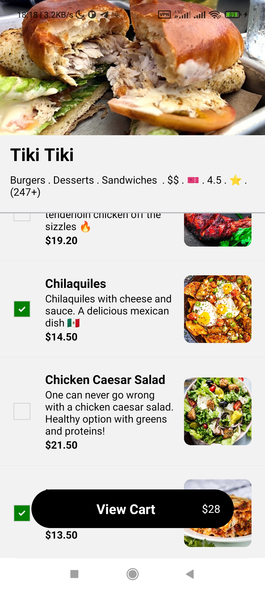
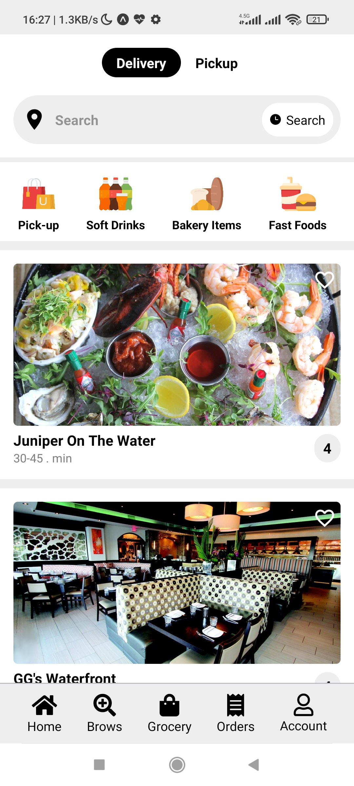
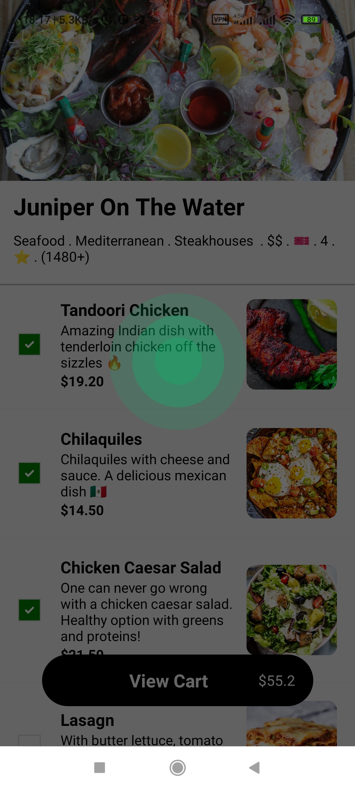
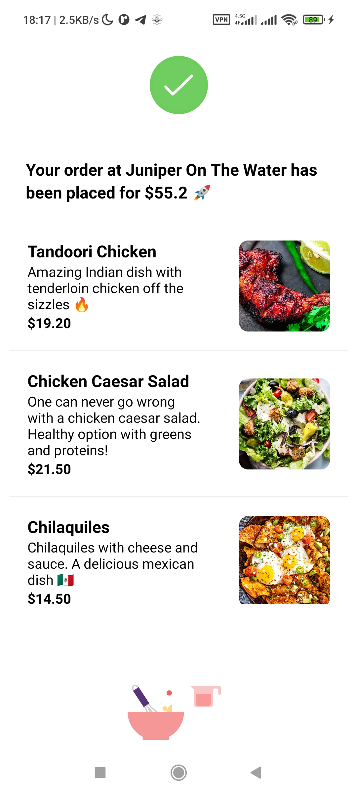

<h1 align="center">
 🔥 Uber Eats Clone App (React Native using expo) 🔥
</h1>
<h3 align="center">
  Just like real Uber Eats app. You can find resturants based on your location and order foods.
</h3>
<hr />
<div style="display:flex; align-items: center; justify-content:space-between" align="center">
  
  
  
  
</div>

# Installation

```
git clone https://github.com/DtechB/uber-eats-clone.git
cd uber-eats-clone
```

```
yarn install
```

```
yarn start
```
### and then run on your phone or emulator

<hr />

## Packages and technologies that used in project:
<a href="https://developer.mozilla.org/en-US/docs/Web/JavaScript" title="JavaScript"></a>
<a href="https://reactjs.org/" title="React"></a>
<a href="https://redux.js.org/" title="Redux"></a>
<a href="https://www.npmjs.com/" title="npm"></a>
<a href="https://yarnpkg.com/" title="Yarn"></a>
<a href="https://www.firebase.com/" title="Firebase"></a>
<a href="https://www.yelp.com/" title="yelp"></a>

## Install Demo android app

[DEMO](https://expo.dev/accounts/dtechb/projects/uber-eats-clone/builds/90d8e06d-fde8-4aa3-a4c0-088cb39acdf6)

